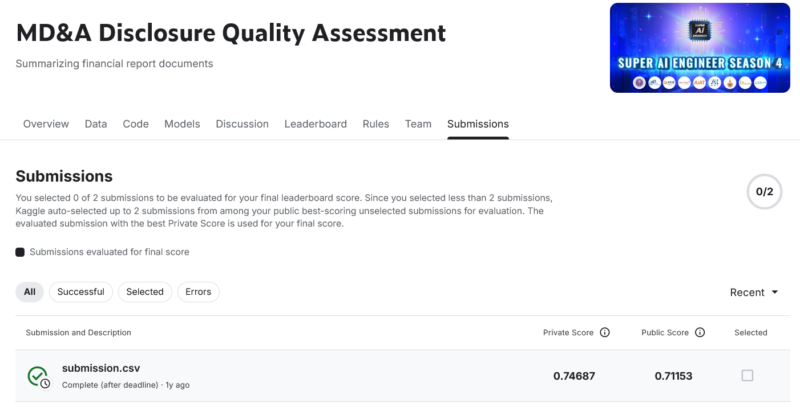

Online Hackathon on MD&A Disclosure Quality Assessment (https://www.kaggle.com/competitions/MDA-Disclosure-Quality-Assessment)
- My code notebook: https://tinyurl.com/3vejbk8b
- My final result includes: 
  
  - Model: MultiOutputClassifier(estimator=DecisionTreeClassifier()) implemented by using scikit-learn

  - Accuracy: ~75% for private score, ~71% for public score

  